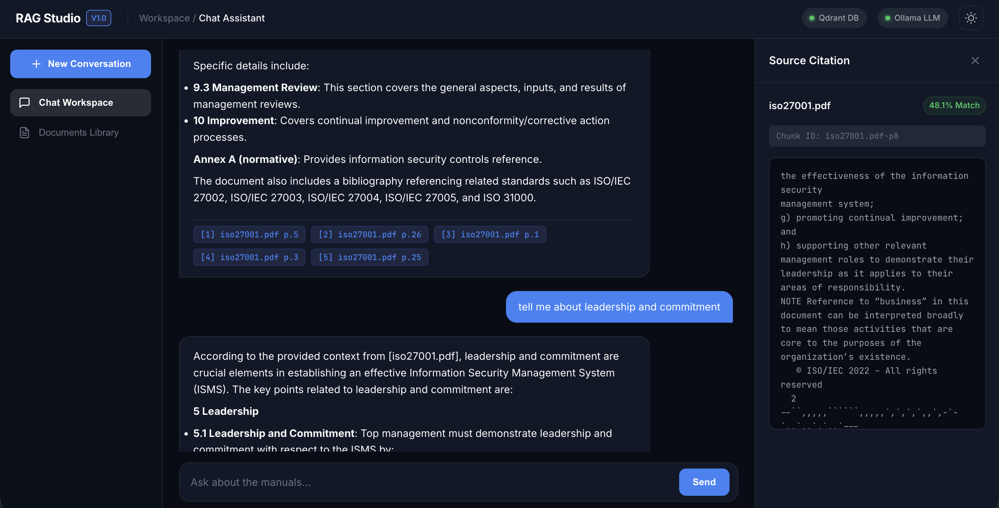
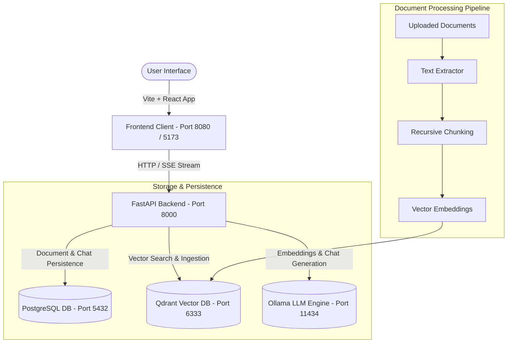

# RAG Studio — Knowledge Base AI Assistant



[](https://fastapi.tiangolo.com/)
[](https://react.dev/)
[](https://www.typescriptlang.org/)
[](https://github.com/Eklavya-San/document_rag/actions/workflows/ci.yml)
[](https://www.postgresql.org/)
[](https://qdrant.tech/)
[](https://ollama.ai/)
[](https://www.docker.com/)

**RAG Studio** is a production-grade Retrieval-Augmented Generation (RAG) platform built for intelligent document search, real-time chunk streaming, and citation inspection. Powered by a **FastAPI** backend, **PostgreSQL** relational store, **Qdrant** vector database, local **Ollama** LLMs, and an executive **Vite + React** single-page application.

---

## ✨ Features

- 🎯 **Interactive Source Citation Inspector**: Click inline citation badges (`[1]`, `[2]`) in chat responses to open a right side drawer displaying exact text chunks, vector similarity match percentages (e.g. `87.7% Match`), and chunk IDs.
- 🌓 **Dual Light/Dark Theme System**: Executive SaaS styling with deep midnight dark mode and clean slate light mode, built with zero-dependency CSS variables.
- 💬 **Streaming SSE Responses**: Real-time server-sent event (SSE) streaming with smooth markdown rendering, code block syntax highlighting, and 1-click snippet copy buttons.
- 📁 **Drag-and-Drop Document Ingestion**: Ingest `.pdf`, `.docx`, `.html`, and `.htm` files with automatic chunking, progress tracking, and index status indicators (`Indexed`, `Processing`, `Error`).
- ⚡ **System Health Monitoring**: Live status pills displaying real-time connectivity states for the Qdrant vector database and Ollama LLM service.
- 📱 **Responsive 3-Zone Workspace Layout**: Collapsible navigation sidebar, centered conversational canvas, and collapsible citation inspection drawer with mobile responsive breakpoints.

---

## 🏗️ Architecture Overview



---

## 🛠️ Tech Stack

| Component | Technology | Description |
| :--- | :--- | :--- |
| **Frontend** | React 18, TypeScript, Vite, Vanilla CSS | Single-page SaaS interface with custom SVG icons |
| **Backend** | Python 3.11, FastAPI, Uvicorn | Async REST API & Server-Sent Events (SSE) streaming |
| **Relational DB** | PostgreSQL 16 | Document metadata, chat sessions, messages |
| **Vector DB** | Qdrant 1.9.1 | Fast similarity search & chunk payload storage |
| **LLM & Embeddings** | Ollama | Local LLM inference (`qwen2.5:32b`) and vector embeddings (`bge-m3`) |
| **Testing** | Vitest, React Testing Library, Pytest | Unit and integration test coverage |
| **Containerization** | Docker, Docker Compose | Orchestration for all services |

---

## 🚀 Getting Started

### Prerequisites
- [Docker Desktop](https://www.docker.com/products/docker-desktop/) (recommended for containerized execution)
- Or **Node.js >= 18** and **Python >= 3.11** for local development.

---

### Option A: Quick Start with Docker Compose (Recommended)

Run all services (API, Web UI, Postgres, Qdrant, and Ollama) with a single command:

```bash
docker compose up --build
```

Pull the required Ollama models once (first run only):

```bash
docker compose exec ollama ollama pull qwen2.5:32b
docker compose exec ollama ollama pull bge-m3
```

Access the applications:
- 🌐 **Web UI Workspace**: [http://localhost:8080](http://localhost:8080)
- 🔌 **FastAPI Docs (Swagger)**: [http://localhost:8000/docs](http://localhost:8000/docs)
- 📊 **Qdrant Dashboard**: [http://localhost:6333/dashboard](http://localhost:6333/dashboard)

---

### Option B: Local Development Setup

#### 1. Start Postgres & Qdrant Vector DB
```bash
docker compose up -d postgres qdrant
```

#### 2. Backend Setup (`api/`)
```bash
cd api
python3 -m venv .venv
source .venv/bin/activate
pip install -r requirements.txt -r requirements-dev.txt

# Run FastAPI server
uvicorn app.main:app --reload --port 8000
```

#### 3. Frontend Setup (`web/`)
```bash
cd web
npm install

# Start Vite dev server (runs on port 5173 and proxies API requests to :8000)
npm run dev
```

---

## 🧪 Running Tests

### Frontend Unit Tests (Vitest)
```bash
cd web
npm test
```

### Production Frontend Build Verification
```bash
cd web
npm run build
```

### Backend Unit Tests (Pytest)
```bash
cd api
pytest
```

---

## 📁 Repository Directory Structure

```
rag_1/
├── api/                   # FastAPI backend service
│   ├── app/
│   │   ├── main.py        # Application entrypoint & CORS setup
│   │   ├── config.py      # App settings & environment variables
│   │   ├── rag/           # RAG retrieval & streaming logic
│   │   ├── qdrant/        # Qdrant vector store integrations
│   │   ├── db/            # SQLAlchemy models, migrations, & repositories
│   │   ├── ingestion/     # Document parsing & chunking pipeline
│   │   └── routers/       # Endpoint routes
│   ├── Dockerfile
│   └── requirements.txt
├── web/                   # Vite + React TypeScript frontend
│   ├── src/
│   │   ├── App.tsx        # Main workspace 3-zone shell
│   │   ├── Chat.tsx       # Streaming chat & prompt pills
│   │   ├── Documents.tsx  # Document library & dropzone
│   │   ├── styles.css     # Design tokens & responsive styling
│   │   └── components/
│   │       ├── Header.tsx           # Status bar & theme switcher
│   │       ├── Sidebar.tsx          # Workspace navigation
│   │       ├── CitationDrawer.tsx   # Source chunk inspection panel
│   │       ├── ThemeContext.tsx     # Light/Dark mode state
│   │       └── Icons.tsx            # SVG vector icon primitives
│   ├── Dockerfile
│   └── package.json
├── docs/                  # Project specifications & design architecture
├── docker-compose.yml     # Multi-container orchestration
└── README.md              # Project documentation
```

---

## 📜 License

This project is licensed under the [MIT License](LICENSE).
